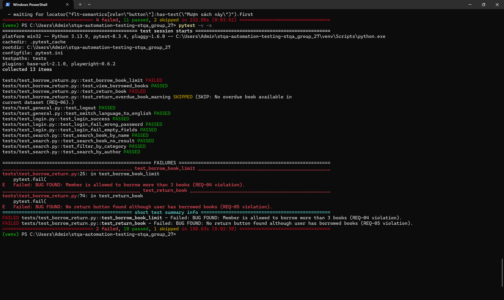

# SUBMISSION REPORT

## Project Information

* **Course:** Software Testing & Quality Assurance (STQA)
* **Team:** Group 27
* **System Under Test:** Library Management System
* **Test Type:** Automated Functional Testing
* **Testing Tool:** Pytest + Playwright
* **Execution Date:** 12/06/2026

---

# 1. Executive Summary

An automated test suite was developed and executed to verify the core functional requirements of the Library Management System. The test suite focuses on authentication, book searching, filtering, borrowing, returning, overdue handling, and general system features.

A total of **13 automated test cases** were executed.

The overall execution result shows that most core functionalities are working correctly. However, two defects were identified in critical business workflows related to borrowing and returning books. These issues directly affect the main purpose of the library system and should be addressed before production deployment.

---

# 2. Test Execution Results

| Metric           | Value  |
| ---------------- | ------ |
| Total Test Cases | 13     |
| Passed           | 10     |
| Failed           | 2      |
| Skipped          | 1      |
| Pass Rate        | 76.92% |

---

# 3. Detailed Results

## 3.1 Passed Tests (10)

The following functionalities behaved according to the expected requirements:

### Authentication

* Login with valid credentials
* Login with incorrect password
* Login with empty credentials

### Search and Filtering

* Search books by title
* Search books by author
* Search with no matching result
* Filter books by category

### General Features

* User logout
* Language switching (Vietnamese ↔ English)

### Borrowing Records

* View currently borrowed books

These results indicate that the system provides stable support for authentication and information retrieval functionalities.

---

## 3.2 Failed Tests (2)

### BUG-01 — Borrow Limit Violation (REQ-04)

**Test Case:** Borrow Book Limit

#### Requirement

A member is allowed to borrow a maximum of 3 books simultaneously.

#### Expected Result

The system must prevent any borrowing operation once the member reaches the limit of 3 active borrowed books.

#### Actual Result

The system still allows members to continue borrowing books after reaching the maximum limit.

#### Impact

This defect violates a core business rule of the library system and may result in:

* Unfair allocation of library resources
* Reduced availability of books for other members
* Inconsistent borrowing records
* Difficulty managing inventory and circulation

#### Severity

**High**

---

### BUG-02 — Missing Return Book Functionality (REQ-05)

**Test Case:** Return Book

#### Requirement

A member must be able to return any book currently marked as borrowed.

#### Expected Result

The system should display a "Return Book" action for all active borrow records.

#### Actual Result

No return button is displayed even when the user has borrowed books.

#### Impact

This issue blocks the entire return-book workflow and may cause:

* Members being unable to return books
* Borrow records remaining permanently active
* Incorrect overdue calculations
* Accumulation of invalid inventory data

#### Severity

**High**

---

# 4. Skipped Test

### Overdue Return Warning (REQ-06)

#### Test Case

Return Overdue Book Warning

#### Status

Skipped

#### Reason

The current dataset does not contain any active overdue borrow records that satisfy the preconditions of the test.

#### Recommendation

Prepare dedicated test data containing overdue borrowing transactions to allow complete validation of overdue-book handling and penalty/warning mechanisms.

---

# 5. Quality Assessment

## Strengths

The system demonstrates stable behavior in several important areas:

* User authentication
* Input validation during login
* Book searching functionality
* Category filtering
* Session management (logout)
* Multilingual user interface support

The majority of user-facing operations executed successfully without crashes or unexpected behavior.

## Weaknesses

The identified defects affect two of the most important business processes:

1. Borrowing management
2. Returning management

These processes are fundamental to the operation of a library system. Failures in these areas may significantly reduce system reliability and user trust.

---

# 6. Recommendations

The following corrective actions are recommended before release:

### Priority 1 (Critical Business Impact)

1. Enforce the maximum borrowing limit of 3 books per member.
2. Restore or implement the Return Book functionality for active borrow records.

### Priority 2

3. Prepare dedicated test datasets for overdue-book scenarios.
4. Extend automated regression testing for borrowing and returning workflows.

---

# 7. Conclusion

The automated test execution achieved a pass rate of **76.92%** (10/13 test cases passed).

Although authentication, searching, filtering, logout, and language-switching features operate correctly, two high-severity defects were discovered in the core borrowing and returning workflows.

Therefore, the system **is not recommended for production release in its current state** until the identified defects are resolved and regression testing confirms compliance with REQ-04 and REQ-05.

## Evidence

